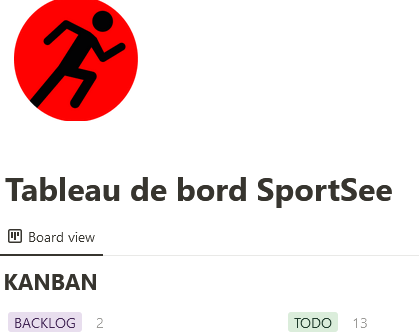
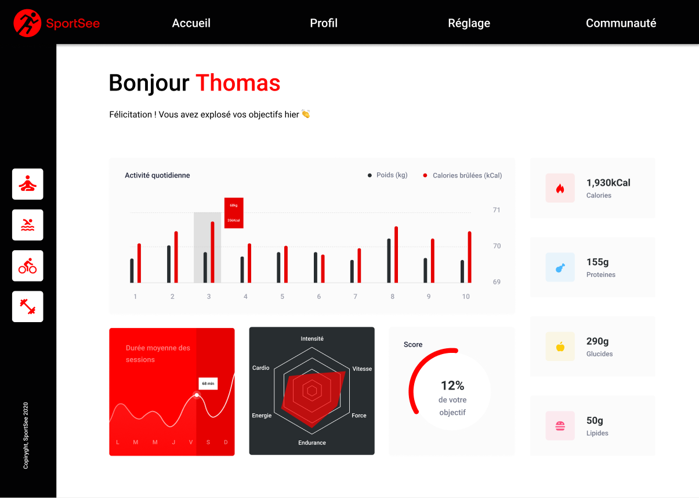

# SportSee Project-12

Projet 12 - Développer un tableau de bord d'analytics avec React

## Author :

- BERAL Anthony

## Prerequisites : 

- [NodeJS(v16.13)](https://nodejs.org/en/)

## Dependencies :

- [React](https://reactjs.org/)
- [react-router-dom](https://reactrouter.com/web/guides/quick-start)
- [recharts](https://recharts.org/en-US/)
- [styled-components](https://styled-components.com/)
- [axios](https://axios-http.com/)
- [prop-types](https://github.com/facebook/prop-types)
- Recommended editor: [Visual Studio Code](https://code.visualstudio.com/)

## Ressources Provided :

## Installing and launching Back-End

 - Clone the repository of SportSee Back-End:

`git clone https://github.com/Cydh-aB/P12-back-end-dashboard`

 - Inside this back-end repository, install dependencies:

`npm install`

- Launch back-end on port 3000 (default port):

`npm run start`

## Installing and launching Front-end

- Clone the repository of SportSee Front-End:

`git clone https://github.com/Cydh-aB/P12-SportSee/tree/master/p12-front-end`

- Inside this Front-End repository, install dependencies:

`npm install`

- Lauch Front-End on port 3001:

`npm start`

Front-End is now rendered at URL `http://localhost:3001`

For mocked data : `http://localhost:3001/user/{12 || 18}?mocked`